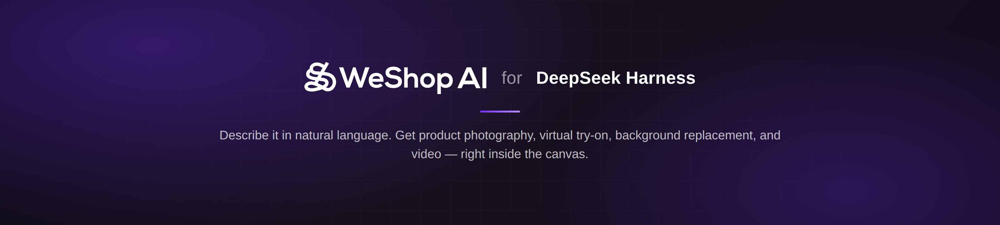
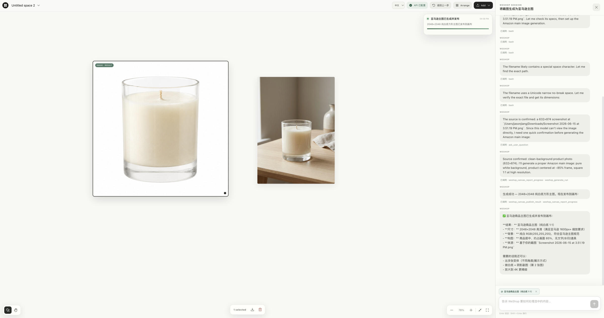

<div align="center">

# WeShop for DeepSeek Harness

**内置于 DeepSeek Harness 的 AI 电商视觉工作台。**

[](./LICENSE)
[]()
[]()
[](./README.md)

在无限画布上选择商品、模特或参考图。

用自然语言描述你想要的效果，结果会直接出现在对话旁边。

[Read the English README](./README.md) · [获取 WeShop API Key](https://www.weshop.ai/apiKey) · [联系我们](mailto:hi@weshop.ai)



</div>

> [!IMPORTANT]
> **安装本插件前，必须先安装并成功运行 DeepSeek Harness。** 本仓库是 Harness 插件，不是独立应用。

## 📖 什么是 WeShop for DeepSeek Harness？

WeShop for DeepSeek Harness 把 WeShop 的电商视觉工作台直接接入 [DeepSeek Harness](https://github.com/deepseek-ai/deepseek-harness)，创作过程和对话共享同一张无限画布，而不是切换到另一个独立工具。

它尤其适合这样的场景：

- 把一张商品图直接生成为干净、符合品牌调性的主图或场景图
- 用虚拟试穿快速看到服装或配饰上身效果
- 在对话内直接替换、扩展或清理背景，无需跳出
- 用一句自然语言描述，批量生成商品摄影图、编辑图和短视频



## ✨ 主要功能

- **🧩 原生插件架构**：原生 Cordis Host 与浏览器插件，无需启动 MCP 子进程。
- **🖼️ 无限画布**：支持框选多选、整组移动、撤销、下载、删除、缩放和平移。
- **💬 同步对话**：Harness 对话与画布实时同步，可通过 `@` 标签引用选中项。
- **🤖 内置 Preset 与 Skills**：随插件安装 `weshop-canvas` Agent Preset 和 WeShop Skills，开箱即用。
- **⚡ 自动发布**：生成的图片、视频、音频和文字自动发布到画布，无需手动下载再上传。
- **🔐 安全的 API Key 管理**：可在画布内配置，也支持 `WESHOP_API_KEY` 环境变量；密钥不会流向浏览器状态或模型。
- **🌐 中英双语界面**：自动识别系统语言，同时支持手动切换。
- **📦 可迁移安装**：打包为单个 `.tgz`，可安装到任意已运行 Harness 的电脑。

## 💡 为什么选择 WeShop？

| 痛点（传统模式） | WeShop 工作台 |
| :--- | :--- |
| **来回切换工具**：商品图、编辑图和视频要分别在不同应用里完成。 | **同一张画布**：摄影、试穿、换背景、编辑和视频都发生在对话所在的同一空间里。 |
| **手动来回搬运**：在别处生成后，还要下载再重新上传。 | **自动发布**：结果一生成就直接出现在画布上。 |
| **只能靠文字描述**：很难精确指向“这张商品图”或“这张参考图”。 | **空间化选择**：在画布上选中素材，直接用 `@` 在对话里引用。 |
| **密钥管理不透明**：不清楚凭证保存在哪里。 | **本地受限存储**：API Key 由本机 Harness Host 保存，不会返回浏览器或模型。 |

## 🚀 快速上手

### 前置步骤：先安装 Harness

安装 Node.js，然后至少成功启动一次官方 Harness Web UI：

```bash
npx @deepseek-ai/dsh web
```

Harness 默认打开在 `http://127.0.0.1:3080`。修改 Web profile 前，请先停止 Harness。

也可以按照官方的 [DeepSeek Harness 源码安装说明](https://github.com/deepseek-ai/deepseek-harness#run)进行安装。

### 1. 构建可迁移安装包

克隆本 private 仓库需要相应的 GitHub 权限。

```bash
git clone git@github.com:weshopai/weshop-dsh-plugin.git
cd weshop-dsh-plugin
corepack enable
pnpm install --frozen-lockfile
pnpm build
pnpm pack
```

完成后会生成类似 `weshop-dsh-weshop-2-0-0.1.25.tgz` 的版本化文件。

### 2. 安装到 Harness Web profile

```bash
PLUGIN_TARBALL="/你的绝对路径/weshop-dsh-weshop-2-0-0.1.25.tgz"
cd ~/.dsh/profiles/web
pnpm add "$PLUGIN_TARBALL"
```

打开 `~/.dsh/profiles/web/package.json`，在 `dsh.profile.bundles` 中追加 `@weshop/dsh-weshop-2-0`。不要删除 Harness 已有的 bundle：

```json
{
  "dsh": {
    "profile": {
      "bundles": [
        "@deepseek-ai/dsh-base",
        "@deepseek-ai/dsh-web-app",
        "@weshop/dsh-weshop-2-0"
      ]
    }
  }
}
```

> **⚠️ 从 `@weshop/dsh-canvas` 升级**
> 如果安装过旧版 `@weshop/dsh-canvas`，请先从 dependencies 和 bundles 中删除。新旧实现同时运行可能造成重复画布或 `shell.overlay` loader 报错。

### 3. 重启 Harness

```bash
npx @deepseek-ai/dsh web
```

新建或打开使用 **WeShop 画布模式** Preset 的任务。WeShop for DeepSeek Harness 会在第一次启用时安装随包提供的 Preset。

## ⚙️ 配置 WeShop OpenAPI

打开画布，点击顶部的 **配置 API Key**。密钥由本机 Harness Host 使用受限文件权限保存，不会返回浏览器，也不会写入画布状态或发送给模型。

也可以在启动 Harness 前设置环境变量：

```bash
export WESHOP_API_KEY="你的密钥"
npx @deepseek-ai/dsh web
```

可以从 [WeShop OpenAPI](https://www.weshop.ai/apiKey) 获取密钥。

## 🏗️ 开发与检查

```bash
pnpm install --frozen-lockfile
pnpm build
pnpm pack --dry-run
```

主要入口与运行组件：

- `lib/index.js` — Cordis Host 插件、工具、Skills、HTTP routes 和私密配置。
- `lib/client.js` — 浏览器画布与同步对话界面。
- `cordis.patch.yml` — Bundle composition 入口。
- `presets/weshop-canvas/` — 内置 WeShop Agent Preset。
- `skills/` — 画布与 WeShop OpenAPI Skills。

## 🔒 迁移与安全说明

- 安装包包含编译后的 Host、浏览器入口、Presets、Skills 和所需资源。
- 目标电脑必须先具备可正常运行的 Harness Web profile。
- API Key 和本地生成资源不会写入安装包，需要在每台电脑上单独配置。
- 画布数据保存在浏览器本地，不会嵌入插件安装包。

## 🤝 联系方式

支持、合作或商业授权请联系 [hi@weshop.ai](mailto:hi@weshop.ai)。

## 📄 许可证

本软件采用 [PolyForm Noncommercial License 1.0.0](LICENSE) 以 source-available 方式提供。允许个人、研究、教育、慈善及其他非商业用途。商业使用必须另行取得 WeShop AI 的书面许可。

由于限制商业使用，本许可证不属于 OSI 认可的开源许可证。

---

<div align="center">

<p>由 WeShop AI 团队倾注 ❤️ 打造。</p>

[](./LICENSE)

</div>
